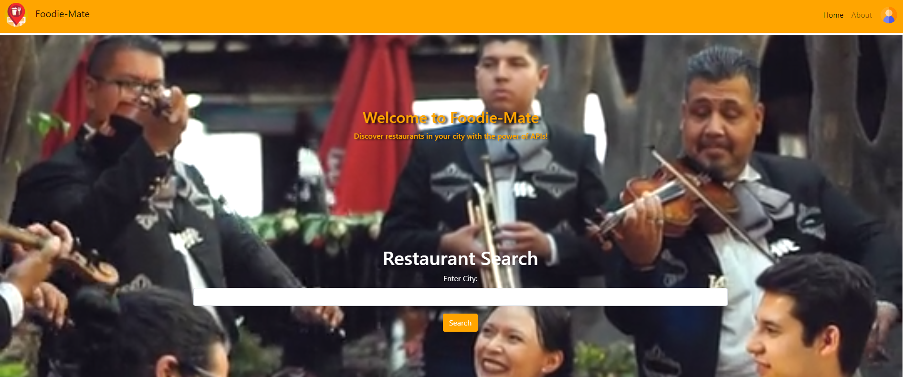
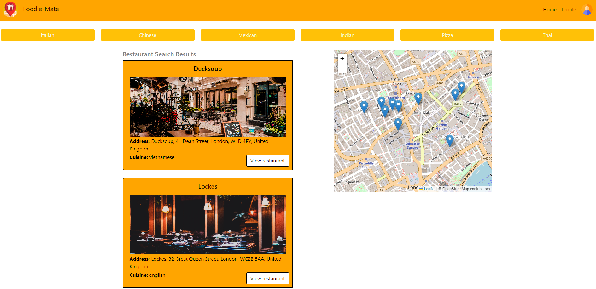
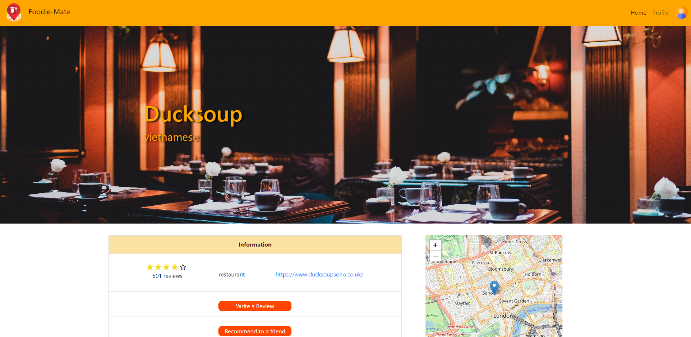

# Foodie-Mate: Discover, Save, and Share with Friends

## Project Overview

Welcome to Foodie-Mate, where culinary exploration meets personalized convenience! This project is designed to revolutionize the way we discover, save, and share our favorite restaurants and dishes with friends. Whether you're a seasoned food enthusiast or just starting your gastronomic journey, Foodie-Mate has you covered.

## Technologies Used

- HTML
- CSS
- JavaScript
- Bootstrap
- API Integration

## Project Structure

## Licensing

Foodie-Mate operates under the [MIT License](LICENSE.md). Feel free to explore, modify, and share the code, keeping the spirit of open collaboration alive.

## Project Repository

You can access the project repository on GitHub: [Foodie-Mate Repository](https://github.com/bakomans/restaurant-explorer-By-Group-8)

## Project Demo

Check out the live demo of Foodie-Mate: [Foodie-Mate Live Demo](https://bakomans.github.io/restaurant-explorer-By-Group-8/)

Feel free to contribute, share feedback, and embark on a delicious journey with Foodie-Mate!

## Thanks

This project is Build by Sundas Alio, James Sneath and Tomasz Bachula.